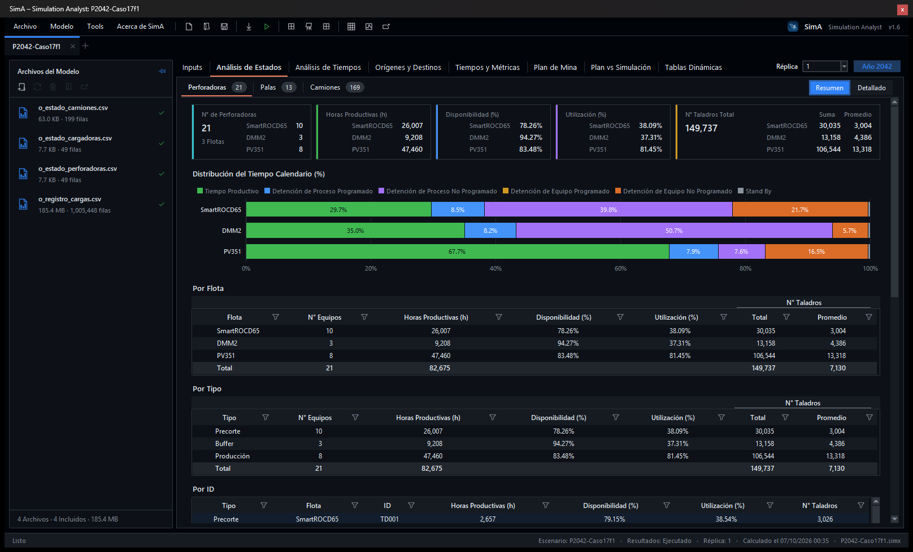
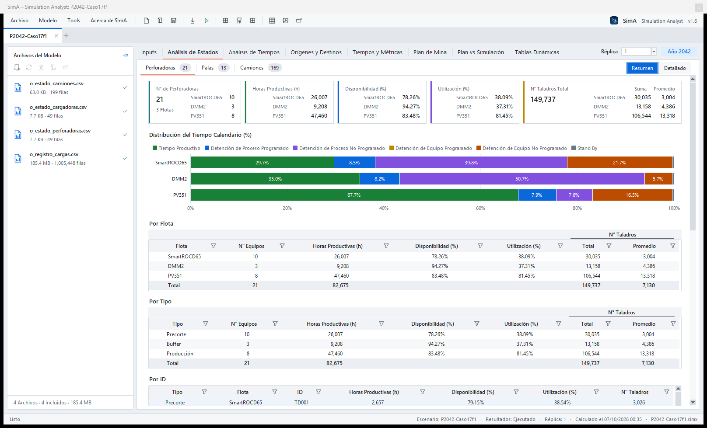
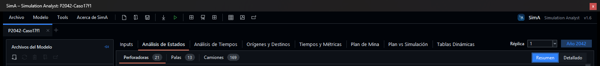
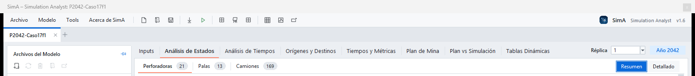
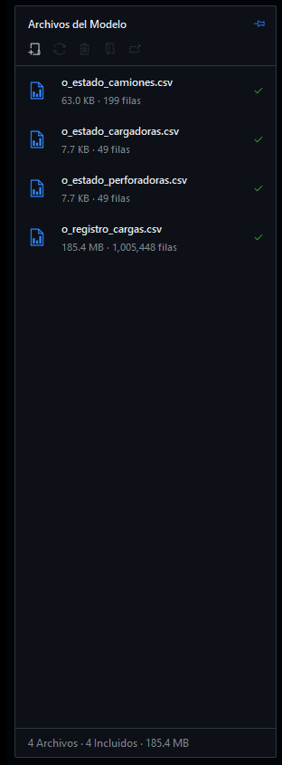
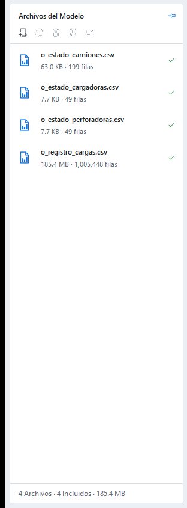
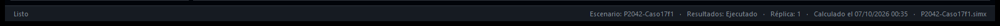
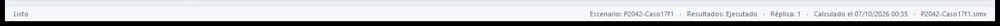

# Interfaz Visual – SimA – Simulation Analyst v1.6

Descripción de la ventana principal: **parte superior** (barra de título, menús, herramientas, marca, escenarios y
pestañas), **parte izquierda** (panel «Archivos del Modelo») y **parte inferior** (barra de estado). Capturas tomadas
con el escenario *P2042-Caso17f1* en la pestaña Análisis de Estados ▸ Perforadoras ▸ Resumen.

| Modo Oscuro | Modo Claro |
|---|---|
|  |  |

```
┌──────────────────────────────────────────────────────────────────────────────────────────────┐
│ ① Barra de título: «SimA – Simulation Analyst: <escenario>»                    ─  ☐  ✕     │
├──────────────────────────────────────────────────────────────────────────────────────────────┤
│ ② Archivo  Modelo  Tools  Acerca de SimA │ ③ herramientas            ④ ◉ SimA Simulation Analyst v1.6 │
├──────────────────────────────────────────────────────────────────────────────────────────────┤
│ ⑤ [ P2042-Caso17f1  ✕ ]  +                                                                   │
├───────────────────────┬──────────────────────────────────────────────────────────────────────┤
│ ⑧ Archivos del Modelo │ ⑥ Inputs · Análisis de Estados · …          Réplica [1 ▾]  [Año 2042] │
│   acciones            │ ⑦ Perforadoras 21 · Palas 13 · Camiones 169          [Resumen|Detallado] │
│   lista de CSV        │                                                                      │
│                       │                  contenido de la pestaña                             │
│   pie (resumen)       │                                                                      │
├───────────────────────┴──────────────────────────────────────────────────────────────────────┤
│ ⑨ Listo                     Escenario · Resultados · Réplica · Calculado el … · archivo.simx │
└──────────────────────────────────────────────────────────────────────────────────────────────┘
```

---

## 1. Parte superior





### ① Barra de título

- Texto: **«SimA – Simulation Analyst: <nombre del escenario>»** (sin escenario: «SimA – Simulation Analyst»).
- Botones de Windows: minimizar, maximizar y cerrar. En modo oscuro la barra de título también es oscura. (En las
  capturas solo se ve ✕ porque se tomaron con la ventana fuera de pantalla.)
- Las ventanas de progreso y los avisos usan el mismo título; las ventanas que abren los botones conservan su
  nombre (p. ej. «Configuración de Tiempos – Perforadoras», «Inputs para Análisis»).

### ② Menús

| Menú | Opciones (atajo) |
|---|---|
| **Archivo** | Nuevo (`Ctrl+N`) · Abrir… (`Ctrl+O`) · Abrir Existente ▸ (escenarios recientes con su carpeta y «Limpiar Lista») · Guardar (`Ctrl+S`) · Guardar Como… (`Ctrl+Shift+S`) · Activar / Desactivar Modo Oscuro (`Ctrl+Shift+M`) · Cerrar Escenario (`Ctrl+W`) · Salir (`Alt+F4`; en una ventana secundaria: Cerrar Ventana) |
| **Modelo** | Importar Resultados Simulación CSV… (`Ctrl+I`) · Importar Métricas Plan… · Ejecutar Análisis (`F5`) · Vincular / Desvincular Filtros entre Tablas y Gráficos · Exportar Reporte Excel… (`Ctrl+E`) · Exportar Reporte PowerPoint… (`Ctrl+Shift+E`) · Exportar Resultados Plan vs Simulación… (`Ctrl+Shift+P`) |
| **Tools** | Análisis de Estados (Pivot) (`Ctrl+Shift+A`) · Registro de Cargas (Pivot) (`Ctrl+Shift+R`) · Abrir Escenario en Ventana Nueva |
| **Acerca de SimA** | Nombre, versión (1.6.0) y fecha de lanzamiento (`F1` o `Alt+S`) |

Los menús se abren con clic o con `Alt` + la inicial (`Alt+A`, `Alt+M`, `Alt+T`). Cada opción lleva su icono.

### ③ Barra de herramientas

Iconos sin texto (el nombre y el atajo aparecen al pasar el mouse), en cuatro grupos separados por líneas tenues:

| Grupo | Iconos |
|---|---|
| Archivo | Nuevo · Abrir · Guardar |
| Análisis | Importar Resultados Simulación CSV · **Ejecutar Análisis** (icono verde) |
| Reportes | Exportar Reporte Excel · Exportar Reporte PowerPoint · Exportar Resultados Plan vs Simulación |
| Herramientas | Análisis de Estados (Pivot) · Registro de Cargas (Pivot) · Abrir Escenario en Ventana Nueva |

### ④ Marca (derecha)

Logo · **SimA** (seminegrita) · «Simulation Analyst» · «v1.6». La versión usa el mismo formato que «Simulation
Analyst» (letra chica y color suave).

### ⑤ Barra de escenarios

- Una pestaña por escenario abierto; la activa tiene fondo de panel, letra en negrita y una línea de color arriba.
- **●** antes del nombre: cambios sin guardar. **✕** cierra el escenario (también clic con la rueda).
- **+** crea un escenario nuevo.
- Arrastrar una pestaña fuera de la barra la lleva a una **ventana nueva** (o a la barra de otra ventana de SimA).
- Clic derecho: Abrir en Ventana Nueva · Mover a Ventana Principal / Ventana N · Cerrar Escenario.

### ⑥ Pestañas principales

**Inputs · Análisis de Estados · Análisis de Tiempos · Orígenes y Destinos · Tiempos y Métricas · Plan de Mina ·
Plan vs Simulación · Tablas Dinámicas**

- La pestaña activa va en seminegrita con un subrayado naranja; separadores tenues entre pestañas.
- Si no caben todas, las últimas pasan a un menú **»**.
- Las pestañas se preparan en segundo plano cuando no se usa el mouse ni el teclado: al elegirlas aparecen sin
  espera ni zonas vacías.
- A la derecha:
  - **Réplica [1 ▾]**: solo en Análisis de Estados, Análisis de Tiempos, Orígenes y Destinos, Tiempos y Métricas y
    Plan de Mina. Empieza en la réplica 1 (o la primera disponible).
  - **Año 2042**: etiqueta azul siempre visible; con clic lleva a Inputs ▸ General ▸ Año.
  - En Inputs, la leyenda **«* Requerido»** en rojo (las subpestañas General, Configuración de Equipos y Origen y
    Destino llevan `*` hasta completarse).

### ⑦ Subpestañas y controles de cada pestaña

Subpestañas con contador (p. ej. **Perforadoras 21 · Palas 13 · Camiones 169**) y, a la derecha, los botones de
vista de la pestaña:

| Pestaña | Subpestañas | Botones a la derecha |
|---|---|---|
| Inputs | General · Configuración de Equipos · Origen y Destino · Vector Plan | «* Requerido» |
| Análisis de Estados | Perforadoras · Palas · Camiones | Resumen / Detallado |
| Análisis de Tiempos | Perforadoras · Palas · Camiones | Análisis Diario (h/d-eq) / Análisis Anual (h/año-eq) |
| Tiempos y Métricas | Tiempos Ciclo · Métricas | Dot Plot / Barra |
| Tablas Dinámicas | Análisis de Estados (Pivot) · Registro de Cargas (Pivot) | — |

---

## 2. Parte izquierda – «Archivos del Modelo»

| Modo Oscuro | Modo Claro |
|---|---|
|  |  |

Recuadro de ancho fijo (290 px a 100 % de escala) a la izquierda de las pestañas, de arriba hacia abajo:

1. **Encabezado**: «Archivos del Modelo» y el alfiler (**Fijar / Ocultar Automáticamente**; azul = fijo).
2. **Barra de acciones** (iconos; los que requieren selección se ven grises sin archivos seleccionados):

   | Icono | Acción |
   |---|---|
   | Agregar archivo | Importar Inputs (agregar CSV al escenario) |
   | Cambiar | Cambiar Input (reemplazar el archivo seleccionado por otro) |
   | Papelera | Eliminar del Escenario (no se borra del disco; pide confirmación) |
   | Carpeta | Mostrar Carpeta del Archivo |
   | Abrir externo | Abrir Archivo con el programa predeterminado |

3. **Lista de archivos CSV**, uno por fila:
   - Icono CSV: **azul** incluido · **gris** excluido · **ámbar** no encontrado.
   - Nombre en negrita y detalle en letra chica: «63.0 KB · 199 filas» (o «Excluido · …», «No encontrado»).
   - A la derecha: **✓ verde** incluido (clic para excluir) · ✓ gris excluido (clic para incluir) · ⚠ ámbar no
     encontrado.
   - Selección como en el Explorador de Windows: clic, `Ctrl`+clic, `Shift`+clic y `Ctrl+A`; la fila seleccionada
     se resalta en azul tenue y el paso del mouse en gris. Clic derecho: Abrir Archivo.
   - Sin archivos: «Aún no hay archivos. Use el botón «Importar Inputs» o Modelo ▸ Importar Resultados Simulación
     CSV para agregarlos.»
4. **Pie**: resumen con singular o plural, p. ej. «4 Archivos · 4 Incluidos · 185.4 MB» y, con varios
   seleccionados, «· 2 Seleccionados».

**Modo Ocultar Automáticamente** (alfiler gris): el panel se reduce a una tira vertical de 28 px con el texto
«Archivos del Modelo» girado; al pasar el mouse o hacer clic el panel aparece encima del contenido y se oculta
solo al salir de él. La preferencia se recuerda para la próxima sesión.

---

## 3. Parte inferior – Barra de estado





Franja gris a todo el ancho, separada del contenido por una línea tenue, con letra chica en color suave:

| Lado | Contenido |
|---|---|
| **Izquierda** | Mensajes del programa: «Listo» por defecto; tras una acción, durante unos segundos, p. ej. «Escenario abierto: P2042-Caso17f1», «Análisis ejecutado correctamente», «Tabla copiada al portapapeles», «Réplica activa: 1». |
| **Derecha** | **Escenario:** nombre · **Resultados:** Ejecutado / Desactualizados / Sin Ejecutar · **Réplica:** n (si hay réplicas) · **Calculado el** DD/MM/YYYY HH:MM (fecha del último cálculo; antes estaba en la pestaña Análisis de Estados) · nombre del archivo `.simx` (si está guardado). Separados por «·». |

---

## 4. Colores base (tema)

Paleta basada en el sistema de diseño de GitHub (Primer). Los colores de estados y gráficos se ajustan a cada modo.

| Elemento | Modo Claro | Modo Oscuro |
|---|---|---|
| Fondo de la ventana | `#ECEFF3` | `#010409` |
| Paneles y recuadros | `#FFFFFF` | `#0D1117` |
| Franjas alternas / barra de estado | `#F5F7F9` | `#161B22` |
| Bordes | `#D6DCE2` | `#30363D` |
| Texto / texto suave | `#1F2328` / `#5F6873` | `#E6EDF3` / `#7D8590` |
| Acento (botones activos, enlaces) | `#0969DA` | `#2F81F7` |
| Subrayado de la pestaña activa | `#FD8C73` | `#F78166` |
| Botón principal (Aceptar, Ejecutar) | `#1F883D` | `#238636` |
| «* Requerido» | `#A4161A` | `#F85149` |

Tipografía: Segoe UI 9 pt (tablas y menús), Segoe UI Semibold 10 pt (subtítulos) y 13 pt (cifras de las tarjetas);
iconos de Segoe MDL2 Assets.
